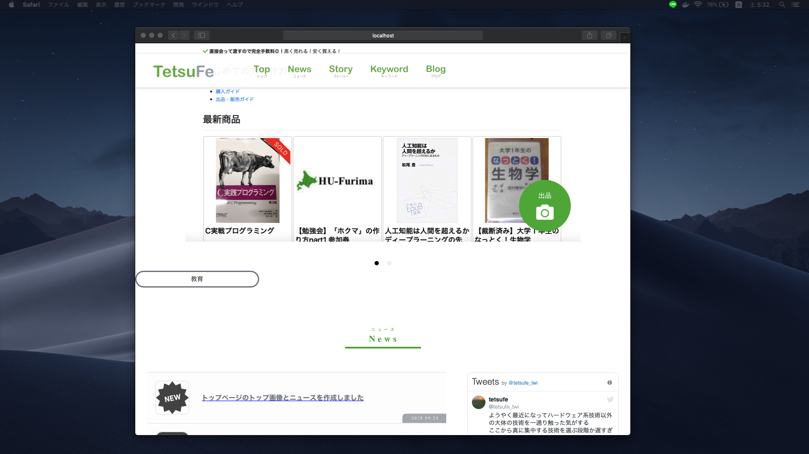

# cssアニメーションを書いてみるpart1

## 角丸のテキスト要素を書いてみる

~/components/IntroAnimation.vue

```vue
<template>
  <div id="intro-bar-1">教育</div>
</template>

<script>
  export default {
    name: "IntroAnimation"
  }
</script>

<style scoped>
  #intro-bar-1 {
    border: solid #767b85;
    border-radius: 20px;
    height: 40px;
    width: 25%;
    text-align: center;
    display: inline-block;
    line-height: 32px;
  }
</style>
```

とりあえずこんな感じです




## 回転させてみる


回転したい要素に対して、cssをつけます。

以下の例では、rotate-bar という名前のアニメーション関数（自分で定義）を実行してます

アニメーションの定義方法

```css
    animation: rotate-bar 5s;
```

このように書くと、rotate-bartというアニメーションを5sかかって再生するということになります。

**この設定だと、アニメーションが終わった後に、要素の状態（大きさ、位置など）は元に戻ってしまいます。**

元に戻したくない場合は、forwordsを最後につけましょう。

```css
    animation: rotate-bar 5s forwards;
```

肝心のアニメーション自体の定義ですが、transformなどを使います。これは普通にcssです。
例えば、先ほどの呼び出し時に指定した5sの50%分がすぎたタイミングで5度の位置になるようにアニメーションした後、
100％のタイミング（つまり5sのタイミング）で、0度の位置にいくようなアニメーションをするということになります。

このように、「どのタイミングでどんな状態か」を指定するだけで、勝手にアニメーションしてくれます！

注意点は、rotateは今の位置からではなく、デフォルトの位置からの回転角であるということです。

例えば、すでにデフォルトの位置から90度傾けていたとしても、アニメーションでrotate(90deg)しても、さらに90度動くということはありません。

```css
@keyframes rotate-bar {
	0%   { transform: rotate(-90deg);}
	50% { transform: rotate(5deg);}
	100% { transform: rotate(0deg);}
}
```

```vue
<style scoped>
  #intro-bar-1 {
    border: solid #767b85;
    border-radius: 20px;
    height: 40px;
    width: 25%;
    text-align: center;
    display: inline-block;
    line-height: 32px;
    -webkit-animation: rotate-bar 5s;
    animation: rotate-bar 5s;
    transform-origin:left 50%
  }

  /***
  keyframes
  ***/
  @-webkit-keyframes rotate-bar {
    0%   { transform: rotate(-90deg);}
    50% { transform: rotate(5deg);}
    100% { transform: rotate(0deg);}
  }

  @keyframes rotate-bar {
    0%   { transform: rotate(-90deg);}
    50% { transform: rotate(5deg);}
    100% { transform: rotate(0deg);}
  }
</style>
```

とりあえず、回転に成功しました

## ３つに複製する
```vue
<template>
  <section id="intro-bars">
    <div id="intro-bar-1" class="intro-bar">教育</div>
    <div id="intro-bar-2" class="intro-bar">プログラミング</div>
    <div id="intro-bar-3" class="intro-bar">怠惰</div>
  </section>
</template>

<script>
  export default {
    name: "IntroAnimation"
  }
</script>

<style scoped>
  #intro-bars {
    transform-origin:left top;
    -webkit-animation: rotate-bar 3s 1s;
    animation: rotate-bar 3s 1s;
    position: relative;
    /*transform-origin:left 50%*/
  }

  #intro-bar-1 {
    position: absolute;
    top: 0;
    left: 0;
    transform-origin:left top;
    transform: rotate(-90deg);
  }
  #intro-bar-2 {
    position: absolute;
    top: 0;
    left: 0;
    transform-origin:left top;
    transform: rotate(-180deg);
  }
  #intro-bar-3 {
    position: absolute;
    top: 0;
    left: 0;
    transform-origin:left top;
    transform: rotate(-270deg);
  }

  .intro-bar {
    border: solid #767b85;
    border-radius: 20px;
    height: 40px;
    width: 25%;
    text-align: center;
    display: inline-block;
    line-height: 32px;
  }

  #intro-bar-1 {
    position: absolute;
    top: 0;
    left: 0;
    transform: rotate(-90deg);
  }
  #intro-bar-2 {
    position: absolute;
    top: 0;
    left: 0;
    transform: rotate(-180deg);
  }
  #intro-bar-3 {
    position: absolute;
    top: 0;
    left: 0;
    transform: rotate(-270deg);
  }

  .intro-bar {
    border: solid #767b85;
    border-radius: 20px;
    height: 40px;
    width: 25%;
    text-align: center;
    display: inline-block;
    line-height: 32px;
  }

  /***
  keyframes
  ***/
  @-webkit-keyframes rotate-bar {
    0%   { transform: rotate(0deg);}
    20% { transform: rotate(95deg);}
    30% { transform: rotate(90deg);}
    50% { transform: rotate(185deg);}
    60% { transform: rotate(180deg);}
    80% { transform: rotate(275deg);}
    90% { transform: rotate(270deg);}
    100% { transform: rotate(270deg);}
  }

  @keyframes rotate-bar {
    0%   { transform: rotate(0deg);}
    20% { transform: rotate(95deg);}
    30% { transform: rotate(90deg);}
    50% { transform: rotate(185deg);}
    60% { transform: rotate(180deg);}
    80% { transform: rotate(275deg);}
    90% { transform: rotate(270deg);}
    100% { transform: rotate(270deg);}
  }
</style>
```


３つのバーをまとめたsectionを回転させ、順番にバーを表示させるようにしました。

３つのバーはposition: absoluteでsectionの左上を原点にするようにして、原点の周りに３本あるように配置しました

アニメーションを動かす際は、キャッシュを適度に削除しないとおかしな動きになることがあるのでこまめにキャッシュを削除しましょう

とはいえ、この状態では、

- 軸がバラバラ
- アニメーションが終わったら元の位置に戻るアニメーションが余分

など、問題があります

## 位置とアニメーションの調整

- 全体を一気に動かすのではなく、一本一本の棒を時間差で動かすように変更
- forwards: アニメーションが終わったら、その位置で要素を止める
- 妥協点: 本当は軸と棒を離したかったが、それほど他人が見て変わるものでもないので軸と棒がくっついてもよいこととした
  - 回転の原点とposition: absoluteでの要素の原点の位置の兼ね合いが難しかったため

```vue
<template>
  <section id="intro-bars">
    <div id="intro-axis"></div>
    <div id="intro-bar-1" class="intro-bar">教育</div>
    <div id="intro-bar-2" class="intro-bar">プログラミング</div>
    <div id="intro-bar-3" class="intro-bar">怠惰</div>
  </section>
</template>

<script>
  export default {
    name: "IntroAnimation"
  }
</script>

<style scoped>
  #intro-bars {
    position: relative;
    top: 10px;
    left: 10px;
    transform-origin: 20px 100px;
  }

  #intro-axis {
    position: absolute;
    top: 90px;
    left: 10px;
    border: solid #767b85;
    border-radius: 50%;
    height: 20px;
    width: 20px;
  }

  #intro-bar-1 {
    position: absolute;
    transform-origin: 20px 20px;
    transform: rotate(-180deg);
    -webkit-animation: rotate-bar-1 0.4s 1s forwards;
    animation: rotate-bar-1 0.4s 1s forwards;
  }
  #intro-bar-2 {
    position: absolute;
    transform-origin: 20px 20px;
    transform: rotate(-180deg);
    -webkit-animation: rotate-bar-2 0.4s 1.5s forwards;
    animation: rotate-bar-2 0.4s 1.5s forwards;
  }
  #intro-bar-3 {
    position: absolute;
    transform-origin: 20px 20px;
    transform: rotate(-180deg);
    -webkit-animation: rotate-bar-3 0.4s 2.0s forwards;
    animation: rotate-bar-3 0.4s 2.0s forwards;
  }

  .intro-bar {
    border: solid #767b85;
    border-radius: 20px;
    height: 40px;
    width: 25%;
    text-align: center;
    display: inline-block;
    line-height: 32px;
  }

  /***
  keyframes
  ***/
  @-webkit-keyframes rotate-bar-1 {
    0%   { transform: rotate(-90deg);}
    50% { transform: rotate(5deg);}
    60% { transform: rotate(0deg);}
    90% { transform: rotate(0deg);}
    100% { transform: rotate(180deg);}
  }

  @-webkit-keyframes rotate-bar-2 {
    0%   { transform: rotate(-90deg);}
    50% { transform: rotate(5deg);}
    60% { transform: rotate(0deg);}
    90% { transform: rotate(0deg);}
    100% { transform: rotate(180deg);}
  }

  @-webkit-keyframes rotate-bar-3 {
    0%   { transform: rotate(-90deg);}
    50% { transform: rotate(5deg);}
    60% { transform: rotate(0deg);}
    90% { transform: rotate(0deg);}
    100% { transform: rotate(0deg);}
  }
</style>
```

完成したアニメーションは以下のようになりました。


ここから、以下をやっていきます

- アニメーション専用画面の作成 -> メイン画面への遷移
- スタイルの変更


## アニメーション専用画面の作成 -> メイン画面への遷移

### 方針
- indexに最初はアニメーションだけを表示する
- そのDOMを削除

- index.vueの一番上の部分にアニメーションコンポーネントを設定
- アニメーションコンポーネント以外をdisplay: none (or state　使う？)
- アニメーション終了時、アニメーションコンポーネント以外をdisplay: none を解除 

中央揃えは、以下のように行った

```vue
<template>
  <div id="wrap" class="sideA">
    <Header/>
    <div id="intro-animation-wrap">
      <IntroAnimation id="intro-animation"/>
    </div>
    <div id="after-animation">
      <article>
        <Top/>
        <IntroAnimation/>
        <News/>
        <Story/>
        <!-- TODO: 頑張ってキャラクターのとこ作る
        <Character/>
        -->
        <Keyword/>
      </article>
    </div>
  </div>
</template>

<style>
  #intro-animation-wrap {
    position: absolute;
    top: 50%;
    left: 50%;
    right: 0;
    bottom: 0;
  }
  #intro-animation {
    vertical-align: middle;
  }
  #after-animation {
    display: none;
  }
</style>
```

こんな感じ


ただ、正直このアニメーションだけだと余白が多すぎてちょっと微妙だと思った。
スタイルをいくつつけても限界がある。

もっと幅をとるアニメーションにしようと考える


```vue
<p>二等辺三角形</p>
<div class="isosceles-triangle"></div>

.isosceles-triangle{
  width: 0;
  height: 0;
  border-left: 200px solid transparent;
  border-right: 200px solid transparent;
  border-bottom: 100px solid #666;
}
```

https://blog.mmmcorp.co.jp/blog/2017/08/04/css_shapes/ を参考に、三角形を書いた


```vue
<template>
  <section class="triangles">
    <div class="isosceles-triangle"></div>
  </section>
</template>

<script>
    export default {
        name: "IntroAnimation2"
    }
</script>

<style scoped>

  @media (max-width: 1024px) {
    #isosceles-triangle {
      position: relative;
      display: inline-block;
      height: 50px; width: 100%;
      text-align: center;
      color: white;
      background: gray;
      line-height: 50px;
      text-decoration: none;
      padding-bottom: 35%;
      background-clip: content-box;
      overflow: hidden;
    }
    #isosceles-triangle:after {
      content: "";
      position: absolute;
      top:0px;  left: 0;
      background-color: inherit;
      padding-bottom: 50%;
      width: 57.7%;
      z-index: -1;
      transform-origin: 0 0;
      transform: rotate(-30deg) skewX(30deg);
    }
  }

  @media (min-width: 1024px) {
		#isosceles-triangle-1 {
      position: relative;
      left: 10%;
      display: inline-block;
      height: 50px; width: 80%;
      text-align: center;
      color: white;
      background: gray;
      line-height: 50px;
      text-decoration: none;
      padding-bottom: 35%;
      background-clip: content-box;
      overflow: hidden;
    }
    
		#isosceles-triangle-1 :after {
      content: "";
      position: absolute;
      top:0;  left: 0;
      background-color: inherit;
      padding-bottom: 50%;
      width: 57.7%;
      z-index: -1;
      transform-origin: 0 0;
      transform: rotate(-30deg) skewX(30deg);
    }
  }

  #isosceles-triangle-1 {
    animation: fall-triangle 1s;
  }

  @keyframes fall-triangle {
    100% { transform: translate3d(0, 100%, 0);}
    /*100% { transform: translate3d(0, -100%, 0);}*/
  }

  @-webkit-keyframes fall-triangle {
    100% { transform: translate3d(0, 100%, 0);}
    /*100% { transform: translate3d(0, -100%, 0);}*/
  }

</style>
```

とりあえず、３角形を下に落とすアニメーションができました。

これをつなげてみます！

```vue
<template>
  <section id="intro-animation">
    <div id="triangles">
      <div class="square" id="square-1"></div>
      <div class="isosceles-triangle" id="isosceles-triangle-1"></div>
      <div class="square" id="square-2"></div>
      <div class="isosceles-triangle" id="isosceles-triangle-2"></div>
      <div class="square" id="square-3"></div>
      <div class="isosceles-triangle" id="isosceles-triangle-3"></div>
      <div class="square" id="square-4"></div>
      <div class="isosceles-triangle" id="isosceles-triangle-4"></div>
    </div>
  </section>
</template>

<script>
    export default {
        name: "IntroAnimation2"
    }
</script>

<style scoped>

  #intro-animation {
    height: 1580px;
    background-color: black;
  }

  #triangles {
    position: relative;
    height: 1500px;
    background-color: yellow;
    z-index: 2;
  }

  @media (min-width: 1024px) {
    #triangles {
      left: 10%;
      width: 80%;
    }
  }

  .square {
    margin: 0;
    animation: fall-triangle 1s forwards;
  }

  .isosceles-triangle:after {
    content: "";
    position: absolute;
    top:0;  left: 0;
    background-color: inherit;
    padding-bottom: 50%;
    width: 57.7%;
    transform-origin: 0 0;
    transform: rotate(-30deg) skewx(30deg);
  }

  .isosceles-triangle {
    display: inline-block;
    text-align: center;
    /* line-height: 50px; */
    text-decoration: none;
    animation: fall-triangle 1s forwards;
  }

  #isosceles-triangle-1 {
    position: absolute;
    top: 180px;
    background: orange;
    padding-bottom: 35%;
    background-clip: content-box;
    overflow: hidden;
  }


  #isosceles-triangle-2 {
    position: absolute;
    top: 280px;
    background: gray;
    /* line-height: 50px; */
    text-decoration: none;
    padding-bottom: 35%;
    background-clip: content-box;
    overflow: hidden;
  }

  #isosceles-triangle-3 {
    position: absolute;
    top: 380px;
    background: blue;
    padding-bottom: 35%;
    background-clip: content-box;
    overflow: hidden;
  }

  #isosceles-triangle-4 {
    position: absolute;
    top: 480px;
    background: green;
    padding-bottom: 35%;
    background-clip: content-box;
    overflow: hidden;
  }


  #square-1 {
    position: absolute;
    top: 80px;
    background: orange;
    z-index: 6;
  }

  #square-2 {
    position: absolute;
    top: 180px;
    background: gray;
    z-index: 5;
  }

  #square-3 {
    position: absolute;
    top: 280px;
    background: blue;
    z-index: 4;
  }

  #square-4 {
    position: absolute;
    top: 380px;
    background: green;
    z-index: 3;
  }

  @media (max-width: 1024px) {

    .square {
      height: 100px;
      width: 100%;
    }

    .isosceles-triangle {
      height: 50px;
      width: 100%;
    }
  }

  @media (min-width: 1024px) {

    .square {
      position: absolute;
      height: 100px;
      width: 100%;
    }

    .isosceles-triangle {
      height: 50px;
      width: 100%;
    }
  }

  #isosceles-triangle-1 {
    z-index: 6;
  }

  #isosceles-triangle-2 {
    z-index: 5;
  }

  #isosceles-triangle-3 {
    z-index: 4;
  }

  #isosceles-triangle-4 {
    z-index: 3;
  }

  @keyframes fall-triangle {
    100% { transform: translate3d(0, 500px, 0);}
    /*100% { transform: translate3d(0, -100%, 0);}*/
  }

  @-webkit-keyframes fall-triangle {
    100% { transform: translate3d(0, 500px, 0);}
    /*100% { transform: translate3d(0, -100%, 0);}*/
  }

</style>
```

長い・・・・

以下のようなアニメーションになりました。


なんかださい・・・

## アニメーションの微調整: 参考にしたアニメーションをみて違いを知る

以下の1:35あたりのアニメーションを参考にしていたので、とりあえずそれをみてみます。

[『恋ニ、甘味ヲソエテ』OPムービー](https://www.youtube.com/watch?v=P0UnHr62bkE)


気づいた違いとしては、

- お手本のほうが三角部分の重なっていない部分が大きい
- お手本のほうが色合いが綺麗

この二つをとりあえずなおします。勉強になる！

```vue
<template>
  <section id="intro-animation">
    <div id="triangles">
      <div class="square" id="square-1"></div>
      <div class="isosceles-triangle" id="isosceles-triangle-1"></div>
      <div class="square" id="square-2"></div>
      <div class="isosceles-triangle" id="isosceles-triangle-2"></div>
      <div class="square" id="square-3"></div>
      <div class="isosceles-triangle" id="isosceles-triangle-3"></div>
      <div class="square" id="square-4"></div>
      <div class="isosceles-triangle" id="isosceles-triangle-4"></div>
    </div>
  </section>
</template>

<script>
    export default {
        name: "IntroAnimation2"
    }
</script>

<style scoped>

  #intro-animation {
    height: 1580px;
    background-color: black;
  }

  #triangles {
    position: relative;
    height: 1600px;
    background-color: orange;
    z-index: 2;
  }

  @media (min-width: 1024px) {
    #triangles {
      left: 10%;
      width: 80%;
    }
  }

  .square {
    margin: 0;
    animation: fall-triangle 1s forwards;
  }

  .isosceles-triangle:after {
    content: "";
    position: absolute;
    top:0;  left: 0;
    background-color: inherit;
    padding-bottom: 50%;
    width: 57.7%;
    transform-origin: 0 0;
    transform: rotate(-30deg) skewx(30deg);
  }

  .isosceles-triangle {
    display: inline-block;
    text-align: center;
    /* line-height: 50px; */
    text-decoration: none;
    animation: fall-triangle 1s forwards;
  }

  #isosceles-triangle-1 {
    position: absolute;
    top: -1520px;
    background: orange;
    padding-bottom: 35%;
    background-clip: content-box;
    overflow: hidden;
  }

  #isosceles-triangle-2 {
    position: absolute;
    top: -1320px;
    background: gray;
    /* line-height: 50px; */
    text-decoration: none;
    padding-bottom: 35%;
    background-clip: content-box;
    overflow: hidden;
  }

  #isosceles-triangle-3 {
    position: absolute;
    top: -1120px;
    background: blue;
    padding-bottom: 35%;
    background-clip: content-box;
    overflow: hidden;
  }

  #isosceles-triangle-4 {
    position: absolute;
    top: -920px;
    background: green;
    padding-bottom: 35%;
    background-clip: content-box;
    overflow: hidden;
  }

  #square-1 {
    position: absolute;
    top: -1720px;
    background: orange;
    z-index: 6;
  }

  #square-2 {
    position: absolute;
    top: -1520px;
    background: gray;
    z-index: 5;
  }

  #square-3 {
    position: absolute;
    top: -1320px;
    background: blue;
    z-index: 4;
  }

  #square-4 {
    position: absolute;
    top: -1120px;
    background: green;
    z-index: 3;
  }

  @media (max-width: 1024px) {

    .square {
      height: 200px;
      width: 100%;
    }

    .isosceles-triangle {
      height: 50px;
      width: 100%;
    }
  }

  @media (min-width: 1024px) {

    .square {
      position: absolute;
      height: 200px;
      width: 100%;
    }

    .isosceles-triangle {
      height: 50px;
      width: 100%;
    }
  }

  #isosceles-triangle-1 {
    z-index: 6;
  }

  #isosceles-triangle-2 {
    z-index: 5;
  }

  #isosceles-triangle-3 {
    z-index: 4;
  }

  #isosceles-triangle-4 {
    z-index: 3;
  }

  @keyframes fall-triangle {
    10% { transform: translate3d(0, 800px, 0);}
    100% { transform: translate3d(0, 1800px, 0);}
    /*100% { transform: translate3d(0, -100%, 0);}*/
  }

  @-webkit-keyframes fall-triangle {
    10% { transform: translate3d(0, 800px, 0);}
    100% { transform: translate3d(0, 1800px, 0);}
    /*100% { transform: translate3d(0, -100%, 0);}*/
  }

</style>
```


- 三角同士の幅を広げた
- 最初は一番下のの三角以外は見えないようにして、何もなかったところに三角が降ってくるようにして強調
- 背景色と最後の三角の色を同じにして統一感を持たせた

## 自己紹介の３角アニメーションの作成

- 最初に自己紹介（自分の特徴を表すキーワード）付きの３角アニメーションを流す
- そのあとでさっき作った３角アニメーションが下へ押し流す

```vue
<template>
  <section id="intro-animation">
    <div id="triangles">
      <div class="intro-square" id="intro-square-1"></div>
      <div class="intro-triangle" id="intro-triangle-1">
        <p>怠惰？</p>
      </div>
      <div class="intro-square" id="intro-square-2"></div>
      <div class="intro-triangle" id="intro-triangle-2">
        <p>思想</p>
      </div>
      <div class="intro-square" id="intro-square-3"></div>
      <div class="intro-triangle" id="intro-triangle-3">
        <p>フロントエンド</p>
      </div>
      <div class="square" id="square-1"></div>
      <div class="isosceles-triangle" id="isosceles-triangle-1"></div>
      <div class="square" id="square-2"></div>
      <div class="isosceles-triangle" id="isosceles-triangle-2"></div>
      <div class="square" id="square-3"></div>
      <div class="isosceles-triangle" id="isosceles-triangle-3"></div>
      <div class="square" id="square-4"></div>
      <div class="isosceles-triangle" id="isosceles-triangle-4"></div>
    </div>
  </section>
</template>

<script>
    export default {
        name: "IntroAnimation2"
    }
</script>

<style scoped>

  .intro-triangle p {
    text-align: center; width: 100%; height: 100%; position: absolute; top: 30%; left: 0; z-index: 1; font-size: 50px; color: white; font-weight: 800;
   }

  /*******************/
  /* 上 アニメーション */

  #intro-animation {
    height: 1280px;
    background-color: black;
  }

  #triangles {
    position: relative;
    height: 1200px;
    background-color: bisque;
    z-index: 2;
  }

  @media (min-width: 1024px) {
    #triangles {
      left: 10%;
      width: 80%;
    }
  }

  .square {
    margin: 0;
    animation: fall-triangle 1s 5s forwards;
  }

  .isosceles-triangle:after {
    content: "";
    position: absolute;
    top:0;  left: 0;
    background-color: inherit;
    padding-bottom: 50%;
    width: 57.7%;
    transform-origin: 0 0;
    transform: rotate(-30deg) skewx(30deg);
  }

  .isosceles-triangle {
    display: inline-block;
    text-align: center;
    /* line-height: 50px; */
    text-decoration: none;
    animation: fall-triangle 1s 5s forwards;
  }

  #isosceles-triangle-1 {
    position: absolute;
    top: -1520px;
    background: orange;
    padding-bottom: 35%;
    background-clip: content-box;
    overflow: hidden;
  }

  #isosceles-triangle-2 {
    position: absolute;
    top: -1320px;
    background: gray;
    /* line-height: 50px; */
    text-decoration: none;
    padding-bottom: 35%;
    background-clip: content-box;
    overflow: hidden;
  }

  #isosceles-triangle-3 {
    position: absolute;
    top: -1120px;
    background: blue;
    padding-bottom: 35%;
    background-clip: content-box;
    overflow: hidden;
  }

  #isosceles-triangle-4 {
    position: absolute;
    top: -920px;
    background: green;
    padding-bottom: 35%;
    background-clip: content-box;
    overflow: hidden;
  }

  #square-1 {
    position: absolute;
    top: -1720px;
    background: orange;
    z-index: 10;
  }

  #square-2 {
    position: absolute;
    top: -1520px;
    background: gray;
    z-index: 9;
  }

  #square-3 {
    position: absolute;
    top: -1320px;
    background: blue;
    z-index: 8;
  }

  #square-4 {
    position: absolute;
    top: -1120px;
    background: green;
    z-index: 7;
  }

  @media (max-width: 1024px) {

    .square {
      height: 200px;
      width: 100%;
    }

    .isosceles-triangle {
      height: 50px;
      width: 100%;
    }
  }

  @media (min-width: 1024px) {

    .square {
      position: absolute;
      height: 200px;
      width: 100%;
    }

    .isosceles-triangle {
      height: 50px;
      width: 100%;
    }
  }

  #isosceles-triangle-1 {
    z-index: 10;
  }

  #isosceles-triangle-2 {
    z-index: 9;
  }

  #isosceles-triangle-3 {
    z-index: 8;
  }

  #isosceles-triangle-4 {
    z-index: 7;
  }

  @keyframes fall-triangle {
    10% { transform: translate3d(0, 800px, 0);}
    100% { transform: translate3d(0, 1800px, 0);}
    /*100% { transform: translate3d(0, -100%, 0);}*/
  }

  @-webkit-keyframes fall-triangle {
    10% { transform: translate3d(0, 800px, 0);}
    100% { transform: translate3d(0, 1800px, 0);}
    /*100% { transform: translate3d(0, -100%, 0);}*/
  }

  /******************/
  /* 下アニメーション */
  /******************/

  @media (min-width: 1024px) {
    #intro-triangles {
      left: 10%;
      width: 80%;
    }
  }

  .intro-square {
    margin: 0;
  }

  .intro-triangle:after {
    content: "";
    position: absolute;
    top:0;  left: 0;
    background-color: inherit;
    padding-bottom: 50%;
    width: 57.7%;
    transform-origin: 0 0;
    transform: rotate(-30deg) skewx(30deg);
  }

  .intro-triangle {
    display: inline-block;
    text-align: center;
    /* line-height: 50px; */
    text-decoration: none;
  }

  #intro-triangle-1 {
    position: absolute;
    top: -1620px;
    background: orange;
    padding-bottom: 35%;
    background-clip: content-box;
    overflow: hidden;
    animation: fall-triangle 1s 3s forwards;
  }

  #intro-triangle-2 {
    position: absolute;
    top: -1620px;
    background: gray;
    /* line-height: 50px; */
    text-decoration: none;
    padding-bottom: 35%;
    background-clip: content-box;
    overflow: hidden;
    animation: fall-triangle 1s 1.5s forwards;
  }

  #intro-triangle-3 {
    position: absolute;
    top: -1620px;
    background: blue;
    padding-bottom: 35%;
    background-clip: content-box;
    overflow: hidden;
    animation: fall-triangle 1s forwards;
  }

  #intro-square-1 {
    position: absolute;
    top: -1820px;
    background: orange;
    z-index: 6;
    animation: fall-triangle 1s 3s forwards;
  }

  #intro-square-2 {
    position: absolute;
    top: -1820px;
    background: gray;
    z-index: 5;
    animation: fall-triangle 1s 1.5s forwards;
  }

  #intro-square-3 {
    position: absolute;
    top: -1820px;
    background: blue;
    z-index: 4;
    animation: fall-triangle 1s forwards;
  }

  @media (max-width: 1024px) {

    .intro-square {
      height: 200px;
      width: 100%;
    }

    .intro-triangle {
      height: 50px;
      width: 100%;
    }
  }

  @media (min-width: 1024px) {

    .intro-square {
      position: absolute;
      height: 200px;
      width: 100%;
    }

    .intro-triangle {
      height: 50px;
      width: 100%;
    }
  }

  #intro-triangle-1 {
    z-index: 4;
  }

  #intro-triangle-2 {
    z-index: 3;
  }

  #intro-triangle-3 {
    z-index: 2;
  }

  @keyframes fall-triangle {
    10% { transform: translate3d(0, 800px, 0);}
    100% { transform: translate3d(0, 1800px, 0);}
    /*100% { transform: translate3d(0, -100%, 0);}*/
  }

  @-webkit-keyframes fall-triangle {
    10% { transform: translate3d(0, 800px, 0);}
    100% { transform: translate3d(0, 1800px, 0);}
    /*100% { transform: translate3d(0, -100%, 0);}*/
  }
</style>
```


出来上がったのがこちらです。ちゃんといい感じで動いています！


