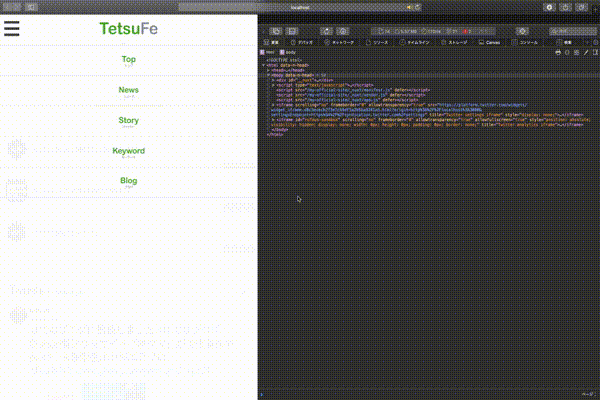
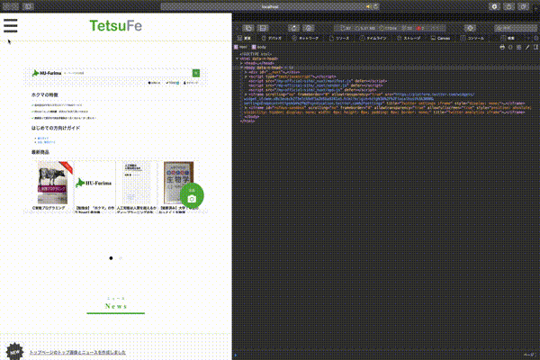
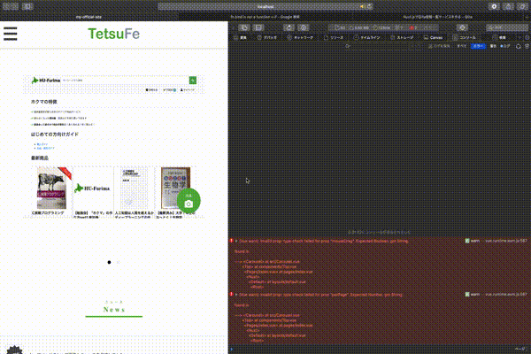

# vueでcssアニメーション


# ハンバーガーメニューを作る

## 作りたいもの
- （スマホの時だけ）ヘッダの左にハンバーガーメニュー
- 押したらバツマークになる
- 押したら下にメニューリスト（リンク）が表示
- メニューリストがクリックされたら（or バツマークがクリックされたら）そのリンクに飛ぶ
- メニューリストがクリックされたら（or バツマークがクリックされたら）高さが低くなって最終的にメニューが閉じる
- メニューが閉じたらまたハンバーガーリンク部分がバツマークからハンバーガーの形に戻る


## 参考にしたもの
- [ぬきたし公式サイト（１８禁注意）](http://qruppo.com)

## デザインパクる
パクろうと思いましたが、いまいちどうやるかわからなかったです。

## クリックに動作を紐づける

```vue
<div id="button-menu" @click="onClickMenuButton">
```
      
SSRじゃない処理をする
https://note.mu/in_colors_net/n/n1a9bc57fe15d

クラスを追加する（追加したときにCSSアニメーションを発火

```vue
<script>
  export default {
    name: "Header",
    methods:{
      onClickMenuButton(){
        if(process.browser) {
          document.querySelector('#menu').classList.toggle('is-open');
        }
      }
    }
  }
</script>
```


## 動作確認
クリックしてデベロッパーツースからクラスが追加されていたらOKです


## CSSアニメーションの追加

```css
  header {
    padding: 0;
    overflow: hidden;
  }

  header.is-open {
    height: 100%;
    -webkit-transition: height 0.25s ease-in;
    transition: height 0.25s ease-in;
  }

  header {
    -webkit-transition: height 0.25s ease-in;
    transition: height 0.25s ease-in;
  }

  #header {
    width: 100%;
    padding: 0 15px;
  }
```

いい感じ！




## リンクを押した時も閉じたい

ヘッダのリンクを押したときにヘッダを閉じたい場合は、以下のように各リンクに@clickをつければ完璧です！

```vue
<nav id="menu">
	<div id="menu01" class="menu" v-scroll-to="'#top'" @click="onClickMenuButton">
		
	</div>
	<div id="menu02" class="menu" v-scroll-to="'#news'" @click="onClickMenuButton">
		
	</div>
</nav>
```




## アコーディオンボタンを変化させたい

アコーディオンが開いているときはバツにしてみましょう１

isMenuOpenがtrueのときは、close.svgを表示するという感じにします

```vue
      <div id="button-menu" @click="onClickMenuButton">
        
        
      </div>
```

```vue
<script>
  export default {
    name: "Header",
    methods: {
      onClickMenuButton() {
        if (process.browser) {
          document.querySelector('header').classList.toggle('is-open');
          this.isMenuOpen = !this.isMenuOpen;
        }
      },
    },
    data() {
      return {
        "isMenuOpen": false,
      }
    }
  }
</script>
```



お疲れ様でした！
