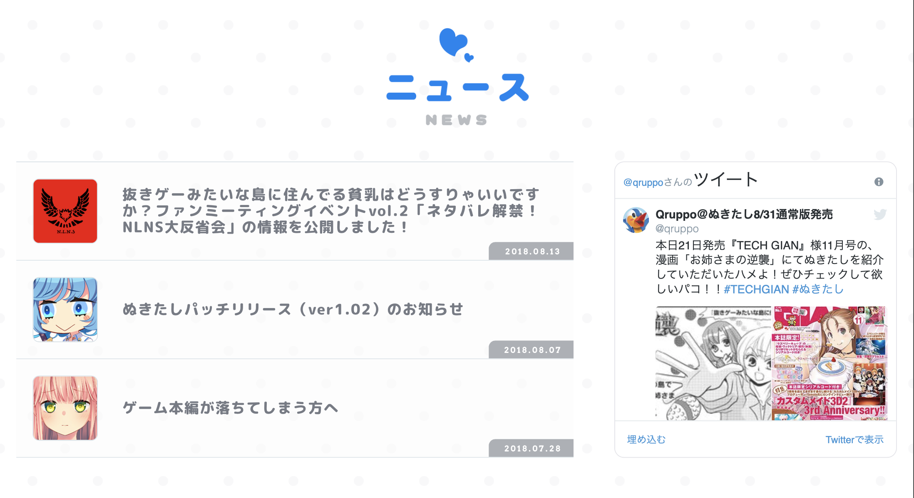

# ぬきたしで学ぶnuxtレイアウト

## ぬきたしとは
[公式サイト（１８禁注意）](http://qruppo.com)

18禁ゲームらしい。自分はプレイ動画をちょっと見たくらいの知識しかないけど、要はバカゲーかつシリアスゲーかつエロゲー・・・らしい。（本当にプレイしてないのでわからない）

公式サイトがスマホ対応しているので珍しいと思ってソースを見たらnuxtで書かれていたので、参考にすることに。

## あんまりnuxt関係ないかも
あんまりnuxt関係ないかもしれません。えろげ公式サイトなんて基本静的ページなはずなので。


## 構成を読む

ソースコードを読むと、どうやら以下のような構成らしい

```html
<body>
  <div class="__nuxt">
    <div class="__layout">
      <div class="sideA">
        <header>
        </header>
        <article>
          <section id="top">
          </section>
          <section id="news">
          </section>
          <section>
          </section>
        </article>
      </div>
    </div>
  </div>
  <script>
  </script>
  <iframe>
  </iframe>
</body>
```

本文の部分に当たる部分が`<article>`タグで囲まれている。

さらに、`<article>`タグの内側には、エロゲ公式サイトにありがちな、top, character, storyなどが `<section>`タグでリストのような形で挿入されている。

後々、これらをComponentとして切り分けていけば、いい感じの構成になりそうだ。


## トップ画像
これはちょっと凝っているようだ。

キャラクター画像の集合体になっていて、マウスオーバーで各画像が微妙に動くようになっている


## ニュース
おおよそ、以下のようになっている。

- ニュース
- タイムライン的ニュース
  - (左)アイコン
  - (右)ニュース本文（文字の大きさ可変）
  - (右下)日付
- twitter timeline

ニュースとタイムラインは、多分media queryで制御。小さくなると横幅いっぱいの２行に分かれる




```html
<section id="news">
  <div class="title-wrap">
    
  </div>
  <div id="news-wrap">
    <div id="news-list">
      <div class="item">
        <div class="item-wrap">
          <a href="./special/rally/vol2/">
            <div class="thumb">
              
            </div>
            <div class="date">
              <p>2018.08.13</p>
            </div>
            <div class="text">
              <p>抜きゲーみたいな島に住んでる貧乳はどうすりゃいいですか？ファンミーティングイベントvol.2「ネタバレ解禁！NLNS大反省会」の情報を公開しました！</p>
            </div>
          </a>
        </div>
      </div>
      <div class="item">
        <div class="item-wrap">
          <a href="./special/patch/">
						<div class="thumb">
							
						</div>
						<div class="date">
							<p>2018.08.07</p>
						</div>
					<div class="text">
						<p>ぬきたしパッチリリース（ver1.02）のお知らせ</p>
						</div>
					</a>
					</div>
				</div>
      <div class="twitter">
        <iframe id="twitter-widget-0" scrolling="no" frameborder="0" allowtransparency="true" allowfullscreen="true" class="twitter-timeline twitter-timeline-rendered" style="position: static; visibility: visible; display: inline-block; width: 100%; height: 364px; padding: 0px; border: none; max-width: 100%; min-width: 180px; margin-top: 0px; margin-bottom: 0px; min-height: 200px;" data-widget-id="profile:qruppo" title="Twitterタイムライン">
        </iframe>
        <script src="https://platform.twitter.com/widgets.js" async="" charset="utf-8">
        </script>
      </div>
    </div>
  </div>
</section>
```

## Storyセクション

実は、StoryとCharacterが同じdiv階層になっている。これに何か意味があるからはわからない。調べていくか？

それほど意味もなさそうなので、（コピペはだいぶしにくくなりそうだが）とりあえず、Storyセクションだけをみていく。

どうやら、いきなりimgタグでhtml的に画像を置くのではなく、CSSで画像を追加しているみたい

どうやら、@mediaを使って、スマホ用の画像とPC用の画像を変化させるためのようだ。推測でしかないが。（sideAとsideBでも別れているみたい）

また、タイトル・背景画像・テキストの３つを重なるようにrelative, absoluteを使っているらしい。relative, absoluteについては以下にまとめた

[position relativeとabsoluteの使い所.md](position relativeとabsoluteの使い所.md)

```html
<div id="story-character-wrap">
  <section id="story">
    <div class="title-wrap">
      
      </div>
      <div id="story-wrap">
        <div class="story"></div>
        <div class="bg"></div>
      </div>
    </section>
```

```css
#story-wrap .story {
  position: relative;
  margin: 0 auto;
}

#story-wrap .story img {
  margin: 0 auto;
}

#wrap.sideA #story-wrap .story {
  background: url("/img/story/sideA/story.png") 50% no-repeat;
  background-size: 840px 520px;
  width: 840px;
  height: 520px;
}

#wrap.sideA #story-wrap .bg {
  position: absolute;
  top: 0;
  left: 0;
  background: url("/img/story/sideA/bg.jpg") 50% no-repeat;
  background-size: cover;
  width: 100%;
  height: 480px;
  z-index: -1;
}

#wrap.sideB #story-wrap .story {
  background: url("/img/story/sideB/story.png") 50% no-repeat;
  background-size: 800px 832px;
  width: 800px;
  height: 832px;
}

@media screen and (max-width:768px) {
  #wrap.sideA #story-wrap .story {
    background: url("/img/story/sideA/story_sp.png") 50% no-repeat;
    background-size: cover;
    width: calc(100vw - 32px);
    height: calc(110vw - 35.2px);
  }

  #wrap.sideA #story-wrap .bg {
    height: 50vw;
  }

  #wrap.sideB #story-wrap .story {
    background: url("/img/story/sideB/story_sp.png") 50% no-repeat;
    background-size: cover;
    width: calc(100vw - 32px);
    height: calc(140vw - 44.8px);
  }
}
```

## キャラクター

わかってはいたが、キャラクターに関しては、割と特殊な構成になっていた

- 左にキャラクター選択バー（縦長）
  - ３つに役割ごとにセクション分け
- 右側にキャラクター(display: noneかどうかで変更)
  - セリフ（縦長）
  - 名前
  - ルビ

``` 
<template>

  <section id="character">
    <div class="title-wrap">
      
    </div>
    <div id="character-wrap">
      <div id="character-nav">
        <div class="title">
          
        </div>
        <div class="nav-wrap">
          <div class="nav hinami">
            <svg>
              <circle cx="28" cy="28" r="25" class="" style="stroke-dashoffset: 157px;"></circle>
            </svg>
            
            
          </div>
          <div class="nav nanase">
            <svg>
              <circle cx="28" cy="28" r="25" class="" style="stroke-dashoffset: 157px;"></circle>
            </svg>
            
            
          </div>
          <div class="nav misaki">
            <svg>
              <circle cx="28" cy="28" r="25" class="" style="stroke-dashoffset: 157px;"></circle>
            </svg>
            
            
          </div>
          <div class="nav asane">
            <svg>
              <circle cx="28" cy="28" r="25" class="" style="stroke-dashoffset: 157px;"></circle>
            </svg>
            
            
          </div>
        </div>
        <div class="title">
          
        </div>
        <div class="nav-wrap">
          <div class="nav tohka">
            <svg>
              <circle cx="28" cy="28" r="25" class="" style="stroke-dashoffset: 157px;"></circle>
            </svg>
            
            
          </div>
          <div class="nav rei">
            <svg>
              <circle cx="28" cy="28" r="25" class="" style="stroke-dashoffset: 157px;"></circle>
            </svg>
            
            
          </div>
          <div class="nav ikuko">
            <svg>
              <circle cx="28" cy="28" r="25" class="" style="stroke-dashoffset: 157px;"></circle>
            </svg>
            
            
          </div>
        </div>
        <div class="title">
          
        </div>
        <div class="nav-wrap">
          <div class="nav kohki">
            <svg>
              <circle cx="28" cy="28" r="25" class="" style="stroke-dashoffset: 157px;"></circle>
            </svg>
            
            
          </div>
          <div class="nav ran">
            <svg>
              <circle cx="28" cy="28" r="25" class="" style="stroke-dashoffset: 157px;"></circle>
            </svg>
            
            
          </div>
          <div class="nav hamedorikun">
            <svg>
              <circle cx="28" cy="28" r="25" class="" style="stroke-dashoffset: 157px;"></circle>
            </svg>
            
            
          </div>
        </div>
      </div>

      <div class="character">
        <span mode="out-in">
          <div class="serif hinami" style="display: none;">
            
          </div>
          <div class="serif nanase" style="display: none;">
          </div>
          <div class="serif misaki" style="display: none;">
            
          </div>
          <div class="serif asane" style="">
            
          </div>
          <div class="serif tohka" style="display:none">
            
          </div>
        </span>

        <span mode="out-in">
          <div class="character-image hinami" style="display: none;">
            
            <div class="sd">
              
            </div>
          </div>
          <div class="character-image nanase" style="display: none;">
            
            <div class="sd">
              
            </div>
          </div>
          <div class="character-image misaki" style="display: none;">
            
            <div class="sd">
              
            </div>
          </div>
          <div class="character-image asane" style="">
            
          </div>
          <div class="character-image tohka" style="display:none">
            
            <div class="sd">
              
            </div>
          </div>
        </span>

        <span mode="out-in">
          <div class="detail hinami" style="display: none;">
            <div class="name">
              
            </div>
            <div class="ruby">
              
            </div>
            <div class="cast">
              
            </div>
            <div class="profile">
              
            </div>
            <div class="sample-voice">
              <div class="title">
                
              </div>
              <div class="voice-wrap">
                <div class="voice">
                  <div class="button">
                    
                  </div>
                </div>
                <div class="voice">
                  <div class="button">
                    
                  </div>
                </div>
                <div class="voice">
                  <div class="button">
                    
                  </div>
                </div>
              </div>
            </div>
          </div>
        </span>
      </div>
    </div>
  </section>
</template>

```vue
```


## 5. 箇条書き

魅力的な箇条書きもあった（１８禁用語注意）

箇条書きだけでなく、comtents-titleもいい感じ。これをsectionのタイトルに使えそう。


```html
<div id="concept-wrap">
	<div id="glossary-wrap">
		<div class="contents-title">
			<p>用語集</p>
			<h3>GLOSSARY</h3>
		</div>
		<div id="glossary-item">
			<div class="glossary">
				<div class="name">
					<p>ドスケベ条例</p>
				</div>
				<p class="description">『この条例は、青藍島でのドスケベ交尾を推奨するものである』というパンチにまみれた一文で始まる青藍島の正式な条例。これによって、島の人間たちは変態交尾に励んでいる。</p>
			</div>
			<div class="glossary">
				<div class="name">
					<p>性人式</p>
				</div>
				<p class="description">条例対象年齢になった男女は、性人式と呼ばれる式に出席し、ドスケベセックスが解禁される。今日からみんな大人だ！</p>
			</div>
		</div>
	</div>
</div>
```

```css
#concept-wrap {
  width: 1120px;
  margin: 0 auto;
}

#concept-wrap .concept-text {
  margin: 0 auto;
}

#wrap.sideA #concept-wrap p {
  color: #767b85;
}

#wrap.sideA #concept-wrap .concept-text {
  background: url("/img/concept/sideA/concept.png") top no-repeat;
  background-size: 900px 445px;
  width: 900px;
  height: 445px;
}

#wrap.sideA #concept-wrap .contents-title h3 {
  width: 224px;
  color: #0082f2!important;
  font-family: Arvo;
  font-weight: 700;
  font-size: 25px;
  line-height: 1.8;
  letter-spacing: 7px;
  text-align: center;
  padding-left: 7px;
  margin: 0 auto 80px;
  border-bottom: 4px solid #0082f2;
}

#wrap.sideA #concept-wrap .contents-title p {
  color: #0082f2!important;
  font-weight: 500;
  font-size: 12px;
  line-height: 1;
  letter-spacing: 6px;
  text-align: center;
  padding-left: 6px;
}

#wrap.sideA #glossary-wrap {
  margin-top: 140px;
}

#wrap.sideA #glossary-wrap .contents-title h3 {
  color: #00d9c5!important;
  border-bottom: 4px solid #00d9c5;
}

#wrap.sideA #glossary-wrap .contents-title p {
  color: #00d9c5!important;
}

#wrap.sideA #glossary-wrap .glossary {
  display: -webkit-box;
  display: -ms-flexbox;
  display: flex;
  -webkit-box-align: center;
  -ms-flex-align: center;
  align-items: center;
  position: relative;
  background: #fff;
  width: 100%;
  height: 70px;
  padding: 15px 30px;
  border-radius: 10px;
  border: 2px solid #00d9c5;
  overflow: hidden;
}

#wrap.sideA #glossary-wrap .glossary:not(:last-child) {
  margin-bottom: 20px;
}

#wrap.sideA #glossary-wrap .name {
  width: 240px;
  margin-right: 50px;
}

#wrap.sideA #glossary-wrap .name p {
  color: #00d9c5;
  font-size: 18px;
  letter-spacing: 2px;
  white-space: pre-wrap;
  padding: 0 0 1px 2px;
}

#wrap.sideA #glossary-wrap .description {
  position: relative;
  width: 770px;
  font-weight: 800;
  font-size: 13px;
  letter-spacing: .5px;
  white-space: pre-wrap;
}

#wrap.sideA #glossary-wrap .description:before {
  content: "";
  position: absolute;
  top: calc(50% - 18px);
  left: -30px;
  background: #00d9c5;
  width: 4px;
  height: 36px;
  border-radius: 2.5px;
}

#wrap.sideB #concept-wrap p {
  font-family: Roboto Condensed,Noto Sans Japanese;
  font-weight: 300;
  font-size: 13px;
  line-height: 1.7;
  letter-spacing: 2.5px;
}

#wrap.sideB #concept-wrap .concept-text {
  background: url("/img/concept/sideB/concept.png") top no-repeat;
  background-size: 710px 510px;
  width: 710px;
  height: 510px;
}

#wrap.sideB #concept-wrap .contents-title {
  position: relative;
  width: 320px;
}

#wrap.sideB #concept-wrap .contents-title h3 {
  color: #f20000;
  font-family: Roboto Condensed;
  font-weight: 700;
  font-size: 28px;
  line-height: 1.2;
  letter-spacing: 5px;
}

#wrap.sideB #concept-wrap .contents-title p {
  font-size: 12px;
  letter-spacing: 4px;
  padding-left: 1px;
}

#wrap.sideB #facility-wrap {
  display: -webkit-box;
  display: -ms-flexbox;
  display: flex;
  position: relative;
  margin: 180px 0 150px;
}

#wrap.sideB #facility-wrap .contents-title {
  margin-top: 14px;
}

#wrap.sideB #facility-wrap .facility {
  width: 720px;
  margin-left: 90px;
}

#wrap.sideB #facility-wrap .facility img {
  width: 100%;
}

#wrap.sideB #facility-wrap .text {
  position: absolute;
  bottom: 14px;
  left: 0;
  width: 320px;
}

#wrap.sideB #facility-wrap .text:before {
  content: "";
  position: absolute;
  top: -24px;
  left: 0;
  background: #000;
  width: 16px;
  height: 1px;
}

#wrap.sideB #facility-wrap .text p {
  letter-spacing: 1.8px;
}

#wrap.sideB #glossary-wrap {
  display: -webkit-box;
  display: -ms-flexbox;
  display: flex;
}

#wrap.sideB #glossary-wrap .glossary {
  width: 675px;
  margin-left: 135px;
}

#wrap.sideB #glossary-wrap .glossary:not(:first-child) {
  margin-top: 35px;
}

#wrap.sideB #glossary-wrap .name {
  position: relative;
  margin-bottom: 3px;
}

#wrap.sideB #glossary-wrap .name p {
  font-weight: 900;
  font-size: 21px;
}

#wrap.sideB #glossary-wrap .name:before {
  content: "";
  position: absolute;
  top: 15px;
  left: -45px;
  background: #000;
  width: 35px;
  height: 1px;
}

#wrap.sideB #glossary-wrap .description {
  font-size: 14px;
  letter-spacing: 2.1px;
}

@media screen and (max-width:1120px) {
  #concept-wrap {
    width: 100vw;
    padding: 0 20px;
    overflow-x: scroll;
  }
}

@media screen and (max-width:768px) {
  #concept-wrap {
    width: 100%;
    padding: 0;
    overflow: hidden;
  }

  #wrap.sideA #concept-wrap .contents-title h3 {
    width: 180px;
    font-size: 21px;
    letter-spacing: 6px;
    padding-left: 6px;
    margin: 0 auto 56px;
  }

  #wrap.sideA #concept-wrap .contents-title p {
    font-size: 10px;
    padding-left: 6px;
  }

  #wrap.sideA #concept-wrap .concept-text {
    background: url("/img/concept/sideA/concept_sp.png") 50% no-repeat;
    background-size: cover;
    width: 100vw;
    height: 100vw;
  }

  #wrap.sideA #facility-wrap {
    margin-top: 80px;
  }

  #wrap.sideA #facility-wrap #facility-item {
    display: block;
    width: 100%;
  }

  #wrap.sideA #facility-wrap .facility {
    width: 100%;
    padding: 0 16px;
  }

  #wrap.sideA #facility-wrap .facility img {
    width: 100%;
  }

  #wrap.sideA #facility-wrap .facility:not(:last-child) {
    margin: 0 0 40px;
  }

  #wrap.sideA #facility-wrap .text {
    width: 100%;
    padding: 20px 6px 0;
  }

  #wrap.sideA #facility-wrap .text p {
    font-size: 13px;
  }

  #wrap.sideA #facility-wrap .facility-copy {
    background: url("/img/concept/sideA/facility_sp.png") top no-repeat;
    background-size: cover;
    width: 100vw;
    height: 18vw;
    margin-top: 36px;
  }

  #wrap.sideA #glossary-wrap {
    width: 100%;
    padding: 0 16px;
    margin-top: 96px;
  }

  #wrap.sideA #glossary-wrap .glossary {
    display: block;
    height: auto;
    padding: 12px 14px 15px;
  }

  #wrap.sideA #glossary-wrap .name {
    width: 100%;
    margin: 0 0 2px;
  }

  #wrap.sideA #glossary-wrap .name p {
    font-size: 16px;
    padding-left: 0;
  }

  #wrap.sideA #glossary-wrap .description {
    width: 100%;
    padding: 0 6px 0 24px;
  }

  #wrap.sideA #glossary-wrap .description:before {
    top: -1px;
    left: 6px;
    height: 100%;
  }

  #wrap.sideB #concept-wrap p {
    line-height: 21px;
    letter-spacing: 2px;
  }

  #wrap.sideB #concept-wrap .contents-title h3 {
    font-size: 24px;
  }

  #wrap.sideB #concept-wrap .contents-title p {
    font-size: 10px;
  }

  #wrap.sideB #concept-wrap .concept-text {
    background: url("/img/concept/sideB/concept_sp.png") top no-repeat;
    background-size: cover;
    width: calc(100vw - 32px);
    height: calc(80vw - 25.6px);
  }

  #wrap.sideB #glossary-wrap {
    display: block;
    padding: 0 16px;
  }

  #wrap.sideB #glossary-wrap .contents-title {
    margin-bottom: 40px;
  }

  #wrap.sideB #glossary-wrap .glossary {
    width: 100%;
    margin-left: 0;
  }

  #wrap.sideB #glossary-wrap .glossary:not(:first-child) {
    margin-top: 40px;
  }

  #wrap.sideB #glossary-wrap .name p {
    font-size: 18px;
    line-height: 24px;
    letter-spacing: 2.5px;
    margin-bottom: 6px;
  }

  #wrap.sideB #glossary-wrap .name:before {
    display: none;
  }

  #wrap.sideB #glossary-wrap .description {
    font-size: 12px;
    line-height: 18px;
    letter-spacing: 1.5px;
  }
}

```


## 6. ヘッダ


