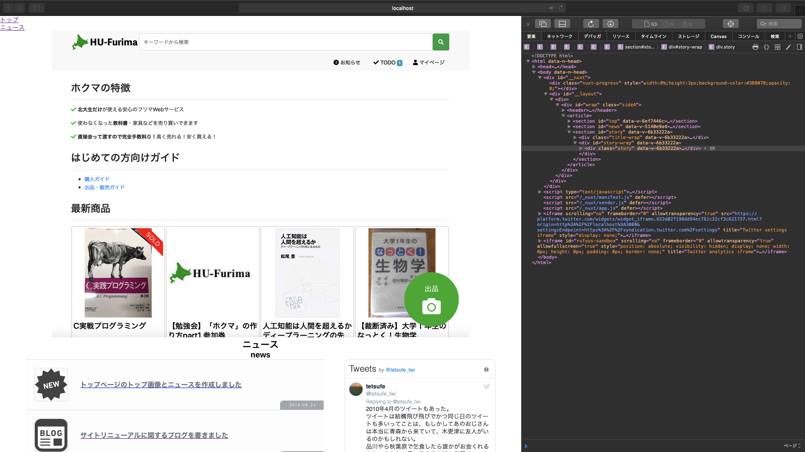
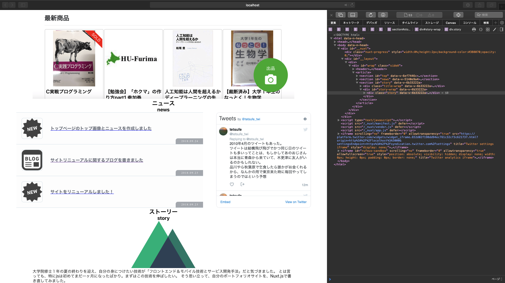
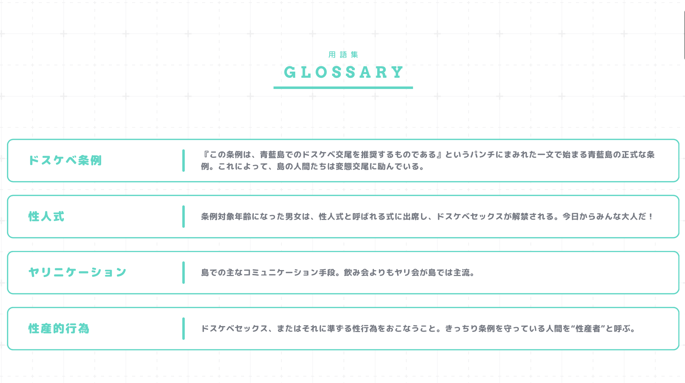
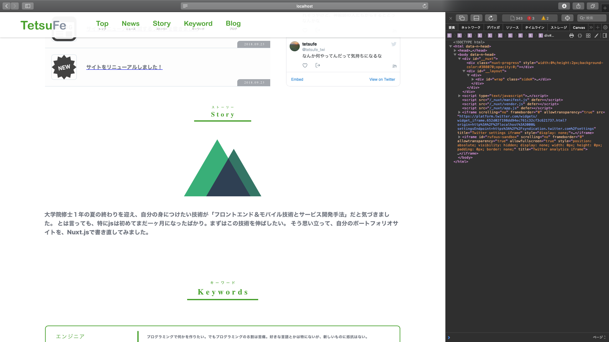

# テンプレから自分のサイトへ・part1

## どこを変更するか
参考: [ディレクトリ構造 - Nuxt.js](https://ja.nuxtjs.org/guide/directory-structure/)

新しいフレームワークを始める時に迷うのが、以下のような点だ

- どこから書き始めればいいのか
- どこを書けば何が変わるのか
- どういう関連になっているか

基本的には、この順番で追っていけば良さそう。

- 共通のレイアウトを管理するファイル: layouts/default.vue
- ルーティング: .nuxt/router.js
- ルーティングを元に呼ばれるファイル: pages/index.vue 
- 「コンポーネント」の「コンポーネント」: .nuxt/components/nuxt.js（基本書き換えなさそう）
- 実際の中身にあたる「コンポーネント」: components/AppLogo.vue

新しく追加する場合、基本的には以下でいけそうだ

- .nuxt/router.jsに追加のルーティングを書く
- pages/ に大枠のvueファイルを書く
- components/ に細かいvueファイルを書く


## 2. トップページ(/)を書いていく

### 2.1 編集するファイルの確認

まずはトップページを書いていく。とりあえず雛形を作るだけなので、細かいスタイルは気にしないで書いていく

となると、

- 共通のレイアウトを管理するファイル: layouts/default.vue

これはとりあえず放置。

次に、

- ルーティング: .nuxt/router.js

ここを見て、ルート(/)がどのpages/xxx.vueと対応しているかみる。

すると、以下に対応しているとわかる。なので、まずはpages/index.vueから編集していく。

- ルーティングを元に呼ばれるファイル: pages/index.vue 

ここで、index.vueで呼び出されている components/AppLogo.vue も気にはなるが、まずはコンポーネントわけは考えない。

というわけで、とりあえずはpages/index.vueを書き換えていく。

まずはまっさらにします。

pages/index.vue

```vue
<template>
  <section class="container">
  </section>
</template>

<script>
//import AppLogo from '~/components/AppLogo.vue'

export default {
  components: {
    //AppLogo
  }
}
</script>

<style>
</style>
```

ブラウザで見ると、まっさらになっていればOKです

### 2.2 書く順番について
topページの書く順番や書き方については、[ぬきたし公式サイト（１８禁注意）](http://qruppo.com)を参考にしました。

だいたい以下のような感じで書いていこうと思います。

```html
<body>
  <div class="__nuxt">
    <div class="__layout">
      <div class="sideA">
        <header>
        </header>
        <article>
          <section id="top">
          </section>
          <section id="news">
          </section>
          <section>
          </section>
        </article>
      </div>
    </div>
  </div>
  <script>
  </script>
  <iframe>
  </iframe>
</body>
```

### 2.3 ヘッダをつける
まずはヘッダです。上から書いていくことにしました。

でも、ヘッダは地味に難しかったので、とりあえず適当に以下のようにつけました

```html
<header>
	<nav id="menu">
		<div class="menu">
			<nuxt-link to="#top">トップ</nuxt-link>
		</div>
		<div class="menu">
			<nuxt-link to="#news">ニュース</nuxt-link>
		</div>
	</nav>
</header>
```


### 2.4 トップ画像をつける

```vue
<template>
  <div id="body">
    <header>
    </header>
    <article>
      <section id="top">
        <div class="img-wrap">
          
        </div>
        <!--
        <div>
          
        </divk>
        -->
      </section>
    </article>
  </div>
</template>

<script>
//import AppLogo from '~/components/AppLogo.vue'

export default {
  components: {
    //AppLogo
  }
}
</script>

<style>
  .img-wrap{
    text-align: center;
  }
  img{
    max-width: 80%;
    object-fit: contain;
  }
</style>
```


## 2.5 ニュース（最新情報）つける

ぬきたしサイトを参考に（ほぼコピーして）作成していく

構成

- ニュース
- タイムライン的ニュース
  - (左)アイコン
  - (右)ニュース本文（文字の大きさ可変）
  - (右下)日付
- twitter timeline

ニュースとタイムラインは、多分media queryで制御。小さくなると横幅いっぱいの２行に分かれる

アイコンには、[]icooon-mono](http://icooon-mono.com)というサイトを使いました。jpg, png, svgから選べますが、サイズを変えてもぼやけた感じになったりしないsvgをダウンロードしました。


```vue
<template>
  <div id="wrap" class="sideA">
    <header>
    </header>
    <article>
      <section id="news">
        <div class="title-wrap">
          <h2>ニュース</h2>
          <h3>news</h3>
        </div>
        <div id="news-wrap">
          <div id="news-list">
            <div class="item">
              <div class="item-wrap">
                <a href="#">
                  <div class="thumb">
                    <!---->
                    
                  </div>
                  <div class="date">
                    <p>2018.09.24</p>
                  </div>
                  <div class="text">
                    <p>トップページのトップ画像とニュースを作成しました</p>
                  </div>
                </a>
              </div>
            </div>
            <div class="item">
              <div class="item-wrap">
                <a href="http://swiftfe0.hatenablog.com/entry/2018/09/23/115644">
                  <div class="thumb">
                    
                  </div>
                  <div class="date">
                    <p>2018.09.23</p>
                  </div>
                  <div class="text">
                    <p>サイトリニューアルに関するブログを書きました</p>
                  </div>
                </a>
              </div>
            </div>
            <div class="item">
              <div class="item-wrap">
                <a href="#">
                  <div class="thumb">
                    
                  </div>
                  <div class="date">
                    <p>2018.09.23</p>
                  </div>
                  <div class="text">
                    <p>サイトをリニューアルしました！</p>
                  </div>
                </a>
              </div>
            </div>
          </div>
          <div class="twitter">
            <div id="twitter-timeline-body">
<a class="twitter-timeline" data-height="364" data-theme="light" href="https://twitter.com/tetsufe_twi?ref_src=twsrc%5Etfw">Tweets by tetsufe_twi</a> <script async src="https://platform.twitter.com/widgets.js" charset="utf-8"></script>            </div>
          </div>
        </div>
      </section>
    </article>
  </div>
</template>

<script>
//import AppLogo from '~/components/AppLogo.vue'

export default {
  components: {
    //AppLogo
  }
}
</script>

<style>
  .img-wrap{
    text-align: center;
  }
  img{
    max-width: 80%;
    object-fit: contain;
  }
  .title-wrap{
    text-align: center;
  }

  #news-wrap {
    display: -webkit-box;
    display: -ms-flexbox;
    display: flex;
    width: 1120px;
    margin: 0 auto;
  }

  #news-list {
    overflow-y: scroll;
  }

  #news-list a {
    -webkit-transition: none;
    transition: none;
  }

  #news-list p {
    -webkit-transition: color .25s ease;
    transition: color .25s ease;
  }

  #wrap.sideA #news-list {
    width: 710px;
    height: 364px;
    margin-right: 50px;
  }

  #wrap.sideA #news-list .item {
    background: rgba(251,251,252,.5);
  }

  #wrap.sideA #news-list .item:first-child {
    border-top: 1px solid #d8e2e8;
  }

  #wrap.sideA #news-list .item-wrap {
    position: relative;
    -ms-flex-wrap: wrap;
    flex-wrap: wrap;
    border-bottom: 1px solid #d8e2e8;
    overflow: hidden;
  }

  #wrap.sideA #news-list .item-wrap,#wrap.sideA #news-list .item-wrap .plane,#wrap.sideA #news-list .item-wrap a {
    display: -webkit-box;
    display: -ms-flexbox;
    display: flex;
    -webkit-box-align: center;
    -ms-flex-align: center;
    align-items: center;
  }

  #wrap.sideA #news-list .item-wrap .plane,#wrap.sideA #news-list .item-wrap a {
    width: 100%;
    padding: 20px 30px 20px 20px;
  }

  #wrap.sideA #news-list .thumb {
    width: 80px;
    height: 80px;
  }

  #wrap.sideA #news-list .thumb img {
    border-radius: 8px;
    border: 1px solid #d8e2e8;
  }

  #wrap.sideA #news-list .date {
    position: absolute;
    bottom: 0;
    right: 0;
  }

  #wrap.sideA #news-list .date p {
    display: inline-block;
    background: #adb0b6;
    width: 104px;
    height: 22px;
    color: #fff;
    font-family: Arvo;
    font-size: 10px;
    letter-spacing: 2px;
    text-align: center;
    padding: 4px 0 0 5px;
    border-top-left-radius: 8px;
  }

  #wrap.sideA #news-list .text {
    width: calc(100% - 120px);
    margin-left: 30px;
  }

  #wrap.sideA #news-list .text p {
    color: #767b85;
    font-weight: 800;
    font-size: 18px;
    line-height: 20px;
  }

  #wrap.sideA .twitter {
    width: 360px;
    height: 364px;
    border-radius: 12px;
    border: 1px solid #e4e4e9;
    overflow: hidden;
  }

  #wrap.sideA .twitter a {
    color: #767b85;
  }

  #wrap:not(.sp).sideA #news-list .item:hover {
    background: hsla(240,3%,94%,.5);
  }

  #wrap:not(.sp).sideA #news-list .item a:hover .text p {
    color: #0082f2;
  }

  #wrap.sideB #news-wrap {
    margin-top: 60px;
  }

  #wrap.sideB #news-list {
    height: 468px;
  }

  #wrap.sideB #news-list a,#wrap.sideB #news-list p {
    color: #fff;
    font-family: Roboto Condensed,Noto Sans Japanese;
    font-weight: 900;
    font-size: 16px;
  }

  #wrap.sideB #news-list .item {
    border-top: 1px solid #fff;
  }

  #wrap.sideB #news-list .item:last-child {
    border-bottom: 1px solid #fff;
  }

  #wrap.sideB #news-list .item-wrap .plane,#wrap.sideB #news-list .item-wrap a {
    display: -webkit-box;
    display: -ms-flexbox;
    display: flex;
    -webkit-box-align: center;
    -ms-flex-align: center;
    align-items: center;
    padding: 25px 0;
  }

  #wrap.sideB #news-list .date {
    margin: 0 70px 0 20px;
  }

  #wrap.sideB #news-list .date p {
    font-family: Teko;
    font-weight: 300;
    font-size: 20px;
    line-height: 1.3;
    letter-spacing: 3px;
    text-align: center;
  }

  #wrap.sideB #news-list .date p:not(:first-child) {
    font-weight: 500;
    font-size: 40px;
    line-height: .9;
    letter-spacing: 2px;
  }

  #wrap.sideB #news-list .date p:last-child {
    padding-bottom: 2px;
  }

  #wrap.sideB #news-list .text {
    padding-right: 25px;
  }

  #wrap.sideB #news-list .text a,#wrap.sideB #news-list .text p {
    font-weight: 900;
    font-size: 28px;
    line-height: 36px;
    letter-spacing: 2.5px;
  }

  #wrap:not(.sp).sideB #news-list a:hover p {
    color: #000;
  }

  @media screen and (max-width:1120px) {
    #news-wrap {
      width: 100vw;
      padding: 0 20px;
    }
  }

  @media screen and (max-width:768px) {
    #news-wrap {
      width: 100vw;
      padding: 0;
    }

    #wrap.sideA #news-wrap {
      display: block;
    }

    #wrap.sideA #news-list {
      width: 100%;
    }

    #wrap.sideA #news-list .item-wrap .plane,#wrap.sideA #news-list .item-wrap a {
      padding: 24px 16px;
    }

    #wrap.sideA #news-list .thumb,#wrap.sideA #news-list .thumb img {
      width: 60px;
      height: 60px;
    }

    #wrap.sideA #news-list .date p {
      width: 96px;
      height: 20px;
      padding: 3px 0 0 6px;
      border-top-left-radius: 8px;
    }

    #wrap.sideA #news-list .text {
      width: calc(100% - 76px);
      margin-left: 16px;
    }

    #wrap.sideA #news-list .text a,#wrap.sideA #news-list .text p {
      font-size: 14px;
      line-height: 17px;
    }

    #wrap.sideA .twitter {
      width: calc(100% - 32px);
      margin: 32px auto 0;
    }

    #wrap.sideA .twitter iframe {
      width: 100vw!important;
    }

    #wrap.sideB #news-list {
      height: 364px;
      padding: 0 16px;
    }

    #wrap.sideB #news-list .item-wrap .plane,#wrap.sideB #news-list .item-wrap a {
      padding: 20px 0;
    }

    #wrap.sideB #news-list .date {
      margin: 0 16px 0 12px;
    }

    #wrap.sideB #news-list .date p {
      font-size: 16px;
    }

    #wrap.sideB #news-list .date p:not(:first-child) {
      font-size: 32px;
      letter-spacing: 2.5px;
    }

    #wrap.sideB #news-list .text {
      padding-right: 4px;
    }

    #wrap.sideB #news-list .text a,#wrap.sideB #news-list .text p {
      font-size: 20px;
      line-height: 24px;
    }
  }
```


## 3. コンポーネントに分けてみる
結構index.vueのコードが長くなってきたので、ここでコンポーネントに分けてみましょう。

幸い、ヘッダ、トップ（画像）、ニュースと３つにわかれているので、この３つをコンポーネントにしてみます


## 3.1 ヘッダのコンポーネント化

~/components/Header.vue

```vue
<template>
  <nav id="menu">
    <div class="menu">
      <nuxt-link to="#top">トップ</nuxt-link>
    </div>
    <div class="menu">
      <nuxt-link to="#news">ニュース</nuxt-link>
    </div>
  </nav>
</template>

<script>
    export default {
        name: "Header"
    }
</script>

<style scoped>

</style>
```

pages/index.vue

```vue
<template>
  <div id="wrap" class="sideA">
    <header>
      <Header/>
    </header>
	</div>
</template>

<script>

import Header from '~/components/Header.vue'

export default {
  components: {
    Header,
  }
}
</script>

```

cssは特につけていなかったので、これでOKです


## 3.2 トップセクションのコンポーネント化

~/components/Top.vue

```vue
<template>
  <section id="top">
    <div class="img-wrap">
      
    </div>
    <!--
      <div>
          
      </divk>
      -->
  </section>
</template>

<script>
    export default {
        name: "Top.vue"
    }
</script>

<style scoped>

  .img-wrap{
    text-align: center;
  }
  img{
    max-width: 80%;
    object-fit: contain;
  }

</style>
```

pages/index.vue

```vue
<template>
  <!-- 略 -->
    <article>
      <Top/>
      <section id="news">
      </section>
    </article>
  <!-- 略 -->
</template>

<script>

import Header from '~/components/Header.vue'
import Top from '~/components/Top.vue'

export default {
  components: {
    Header,
    Top,
  }
}
</script>
```


## 3.3 ニュースセクション

~/components/News.vue

```vue
<template>
  <section id="news">
    <div class="title-wrap">
      <h2>ニュース</h2>
      <h3>news</h3>
    </div>
    <div id="news-wrap">
      <div id="news-list">
        <div class="item">
          <div class="item-wrap">
            <a href="#">
              <div class="thumb">
                <!---->
                
              </div>
              <div class="date">
                <p>2018.09.24</p>
              </div>
              <div class="text">
                <p>トップページのトップ画像とニュースを作成しました</p>
              </div>
            </a>
          </div>
        </div>
        <div class="item">
          <div class="item-wrap">
            <a href="http://swiftfe0.hatenablog.com/entry/2018/09/23/115644">
              <div class="thumb">
                
              </div>
              <div class="date">
                <p>2018.09.23</p>
              </div>
              <div class="text">
                <p>サイトリニューアルに関するブログを書きました</p>
              </div>
            </a>
          </div>
        </div>
        <div class="item">
          <div class="item-wrap">
            <a href="#">
              <div class="thumb">
                
              </div>
              <div class="date">
                <p>2018.09.23</p>
              </div>
              <div class="text">
                <p>サイトをリニューアルしました！</p>
              </div>
            </a>
          </div>
        </div>
      </div>
      <div class="twitter">
        <div id="twitter-timeline-body">
          <a class="twitter-timeline" data-height="364" data-theme="light" href="https://twitter.com/tetsufe_twi?ref_src=twsrc%5Etfw">Tweets by tetsufe_twi</a> <script async src="https://platform.twitter.com/widgets.js" charset="utf-8"></script>            </div>
      </div>
    </div>
  </section>
</template>

<script>
    export default {
        name: "News"
    }
</script>

<style scoped>
  .title-wrap{
    text-align: center;
  }

  #news-wrap {
    display: -webkit-box;
    display: -ms-flexbox;
    display: flex;
    width: 1120px;
    margin: 0 auto;
  }

  #news-list {
    overflow-y: scroll;
  }

  #news-list a {
    -webkit-transition: none;
    transition: none;
  }
  
  /* 略 */

</style>
```

pages/index.vue

```vue
<template>
  <div id="wrap" class="sideA">
    <header>
      <Header/>
    </header>
    <article>
      <Top/>
      <News/>
    </article>
  </div>
</template>

<script>

import Header from '~/components/Header.vue'
import Top from '~/components/Top.vue'
import News from '~/components/News.vue'

export default {
  components: {
    Header,
    Top,
    News,
  }
}
</script>

<style>
</style>
```

このindex.vueは全文です！かなり見通しがよくなりました！


## 4. Story（サイト作成の経緯）セクション

ここからは、最初からコンポーネントで組んでいきます。

セクション分けがちゃんとできていれば、コンポーネント分けもちゃんとできそうだということが、さっき確認できたからです。

pages/index.vue

```vue
<template>
  <div id="wrap" class="sideA">
    <header>
      <Header/>
    </header>
    <article>
      <Top/>
      <News/>
      <Story/>
    </article>
  </div>
</template>

<script>

import Header from '~/components/Header.vue'
import Top from '~/components/Top.vue'
import News from '~/components/News.vue'
import Story from '~/components/Story.vue'

export default {
  components: {
    Header,
    Top,
    News,
    Story,
  }
}
</script>

<style>
</style>

```

~/components/Story.vue

```vue
<template>
  <section id="story">
    <div class="title-wrap">
      <!---->
      <h2>ストーリー</h2>
      <h3>story</h3>
      <AppLogo/>
    </div>
    <div id="story-wrap">
      <div class="story">
        大学院修士１年の夏の終わりを迎え、自分の身につけたい技術が「フロントエンド＆モバイル技術とサービス開発手法」だと気づきました。
        とは言っても、特にjsは初めてまだ一ヶ月になったばかり。まずはこの技術を伸ばしたい。
        そう思い立って、自分のポートフォリオサイトを、Nuxt.jsで書き直してみました。
      </div>
    </div>
  </section>
</template>

<script>
  import AppLogo from '~/components/AppLogo.vue'

  export default {
    components: {
      AppLogo,
    },
    name: "Story"
  }
</script>

<style scoped>

  .title-wrap{
    text-align: center;
  }

  #story-wrap .story {
    width: 80%;
    margin: 0 auto;
  }

</style>
```


まずはこんな感じでとりあえず終了。





## 5. Charaterセクション

Characterセクションは、基本的に自分しかいないのでちょい微妙かも。

一応、適当にトレースしてみる


pages/index.vue

```vue
<template>
  <div id="wrap" class="sideA">
    <header>
      <Header/>
    </header>
    <article>
      <Top/>
      <News/>
      <Story/>
      <Character/>
    </article>
  </div>
</template>

<script>

import Header from '~/components/Header.vue'
import Top from '~/components/Top.vue'
import News from '~/components/News.vue'
import Story from '~/components/Story.vue'
import Character from '~/components/Character.vue'

export default {
  components: {
    Header,
    Top,
    News,
    Story,
    Character,
  }
}
</script>

<style>
</style>

```

~/components/Story.vue

```vue
<template>
  <section id="story">
    <div class="title-wrap">
      <!---->
      <h2>ストーリー</h2>
      <h3>story</h3>
      <AppLogo/>
    </div>
    <div id="story-wrap">
      <div class="story">
        大学院修士１年の夏の終わりを迎え、自分の身につけたい技術が「フロントエンド＆モバイル技術とサービス開発手法」だと気づきました。
        とは言っても、特にjsは初めてまだ一ヶ月になったばかり。まずはこの技術を伸ばしたい。
        そう思い立って、自分のポートフォリオサイトを、Nuxt.jsで書き直してみました。
      </div>
    </div>
  </section>
</template>

<script>
  import AppLogo from '~/components/AppLogo.vue'

  export default {
    components: {
      AppLogo,
    },
    name: "Story"
  }
</script>

<style scoped>

  .title-wrap{
    text-align: center;
  }

  #story-wrap .story {
    width: 80%;
    margin: 0 auto;
  }

</style>
```


まずはこんな感じでとりあえず終了。


## 5. Keywordセクション（自分のサイト向けに項目作成）

ぬきたしサイトには、魅力的な箇条書きもあった

（１８禁用語注意）



```html
  <section id="keyword">
    <div id="concept-wrap">
      <div id="keyword-wrap">
        <div class="contents-title">
          <p>キーワード</p>
          <h3>Keywords</h3>
        </div>
        <div id="keyword-item">
          <div class="keyword">
            <div class="name">
              <p>エンジニア</p>
            </div>
            <p class="description">プログラミングで何かを作りたい。でもプログラミングの８割は苦痛。好きな言語とかは特にないが、新しいものに抵抗はない。</p>
          </div>
          <div class="keyword">
            <div class="name">
              <p>サービス開発</p>
            </div>
            <p class="description">有名になりたい。大勢の人が使うサービスを作って褒められたい。</p>
          </div>
          <div class="keyword">
            <div class="name">
              <p>教育熱心</p>
            </div>
            <p class="description">誰かに何かを教えることが好き。気軽に質問される人になりたい。</p>
          </div>
          <div class="keyword">
            <div class="name">
              <p>怠け</p>
            </div>
            <p class="description">怠け癖がある。何かをするのに時間がかかる。本気になれるものを探している。</p>
          </div>
        </div>
      </div>
    </div>
  </section>
```

cssは丸々コピペです

```css
  #concept-wrap {
    width: 1120px;
    margin: 0 auto;
  }

  #concept-wrap .concept-text {
    margin: 0 auto;
  }

  #wrap.sideA #concept-wrap p {
    color: #767b85;
  }

  #wrap.sideA #concept-wrap .concept-text {
    background: url("/img/concept/sideA/concept.png") top no-repeat;
    background-size: 900px 445px;
    width: 900px;
    height: 445px;
  }

  #wrap.sideA #concept-wrap .contents-title h3 {
    width: 224px;
    color: #0082f2!important;
    font-family: Arvo;
    font-weight: 700;
    font-size: 25px;
    line-height: 1.8;
    letter-spacing: 7px;
    text-align: center;
    padding-left: 7px;
    margin: 0 auto 80px;
    border-bottom: 4px solid #0082f2;
  }

  #wrap.sideA #concept-wrap .contents-title p {
    color: #0082f2!important;
    font-weight: 500;
    font-size: 12px;
    line-height: 1;
    letter-spacing: 6px;
    text-align: center;
    padding-left: 6px;
  }

  #wrap.sideA #keyword-wrap {
    margin-top: 140px;
  }

  #wrap.sideA #keyword-wrap .contents-title h3 {
    color: #00d9c5!important;
    border-bottom: 4px solid #00d9c5;
  }

  #wrap.sideA #keyword-wrap .contents-title p {
    color: #00d9c5!important;
  }

  #wrap.sideA #keyword-wrap .keyword {
    display: -webkit-box;
    display: -ms-flexbox;
    display: flex;
    -webkit-box-align: center;
    -ms-flex-align: center;
    align-items: center;
    position: relative;
    background: #fff;
    width: 100%;
    height: 70px;
    padding: 15px 30px;
    border-radius: 10px;
    border: 2px solid #00d9c5;
    overflow: hidden;
  }

  #wrap.sideA #keyword-wrap .keyword:not(:last-child) {
    margin-bottom: 20px;
  }

  #wrap.sideA #keyword-wrap .name {
    width: 240px;
    margin-right: 50px;
  }

  #wrap.sideA #keyword-wrap .name p {
    color: #00d9c5;
    font-size: 18px;
    letter-spacing: 2px;
    white-space: pre-wrap;
    padding: 0 0 1px 2px;
  }

  #wrap.sideA #keyword-wrap .description {
    position: relative;
    width: 770px;
    font-weight: 800;
    font-size: 13px;
    letter-spacing: .5px;
    white-space: pre-wrap;
  }

  #wrap.sideA #keyword-wrap .description:before {
    content: "";
    position: absolute;
    top: calc(50% - 18px);
    left: -30px;
    background: #00d9c5;
    width: 4px;
    height: 36px;
    border-radius: 2.5px;
  }

  #wrap.sideB #concept-wrap p {
    font-family: Roboto Condensed,Noto Sans Japanese;
    font-weight: 300;
    font-size: 13px;
    line-height: 1.7;
    letter-spacing: 2.5px;
  }

  #wrap.sideB #concept-wrap .concept-text {
    background: url("/img/concept/sideB/concept.png") top no-repeat;
    background-size: 710px 510px;
    width: 710px;
    height: 510px;
  }

  #wrap.sideB #concept-wrap .contents-title {
    position: relative;
    width: 320px;
  }

  #wrap.sideB #concept-wrap .contents-title h3 {
    color: #f20000;
    font-family: Roboto Condensed;
    font-weight: 700;
    font-size: 28px;
    line-height: 1.2;
    letter-spacing: 5px;
  }

  #wrap.sideB #concept-wrap .contents-title p {
    font-size: 12px;
    letter-spacing: 4px;
    padding-left: 1px;
  }

  #wrap.sideB #facility-wrap {
    display: -webkit-box;
    display: -ms-flexbox;
    display: flex;
    position: relative;
    margin: 180px 0 150px;
  }

  #wrap.sideB #facility-wrap .contents-title {
    margin-top: 14px;
  }

  #wrap.sideB #facility-wrap .facility {
    width: 720px;
    margin-left: 90px;
  }

  #wrap.sideB #facility-wrap .facility img {
    width: 100%;
  }

  #wrap.sideB #facility-wrap .text {
    position: absolute;
    bottom: 14px;
    left: 0;
    width: 320px;
  }

  #wrap.sideB #facility-wrap .text:before {
    content: "";
    position: absolute;
    top: -24px;
    left: 0;
    background: #000;
    width: 16px;
    height: 1px;
  }

  #wrap.sideB #facility-wrap .text p {
    letter-spacing: 1.8px;
  }

  #wrap.sideB #keyword-wrap {
    display: -webkit-box;
    display: -ms-flexbox;
    display: flex;
  }

  #wrap.sideB #keyword-wrap .keyword {
    width: 675px;
    margin-left: 135px;
  }

  #wrap.sideB #keyword-wrap .keyword:not(:first-child) {
    margin-top: 35px;
  }

  #wrap.sideB #keyword-wrap .name {
    position: relative;
    margin-bottom: 3px;
  }

  #wrap.sideB #keyword-wrap .name p {
    font-weight: 900;
    font-size: 21px;
  }

  #wrap.sideB #keyword-wrap .name:before {
    content: "";
    position: absolute;
    top: 15px;
    left: -45px;
    background: #000;
    width: 35px;
    height: 1px;
  }

  #wrap.sideB #keyword-wrap .description {
    font-size: 14px;
    letter-spacing: 2.1px;
  }

  @media screen and (max-width:1120px) {
    #concept-wrap {
      width: 100vw;
      padding: 0 20px;
      overflow-x: scroll;
    }
  }

  @media screen and (max-width:768px) {
    #concept-wrap {
      width: 100%;
      padding: 0;
      overflow: hidden;
    }

    #wrap.sideA #concept-wrap .contents-title h3 {
      width: 180px;
      font-size: 21px;
      letter-spacing: 6px;
      padding-left: 6px;
      margin: 0 auto 56px;
    }

    #wrap.sideA #concept-wrap .contents-title p {
      font-size: 10px;
      padding-left: 6px;
    }

    #wrap.sideA #concept-wrap .concept-text {
      background: url("/img/concept/sideA/concept_sp.png") 50% no-repeat;
      background-size: cover;
      width: 100vw;
      height: 100vw;
    }

    #wrap.sideA #facility-wrap {
      margin-top: 80px;
    }

    #wrap.sideA #facility-wrap #facility-item {
      display: block;
      width: 100%;
    }

    #wrap.sideA #facility-wrap .facility {
      width: 100%;
      padding: 0 16px;
    }

    #wrap.sideA #facility-wrap .facility img {
      width: 100%;
    }

    #wrap.sideA #facility-wrap .facility:not(:last-child) {
      margin: 0 0 40px;
    }

    #wrap.sideA #facility-wrap .text {
      width: 100%;
      padding: 20px 6px 0;
    }

    #wrap.sideA #facility-wrap .text p {
      font-size: 13px;
    }

    #wrap.sideA #facility-wrap .facility-copy {
      background: url("/img/concept/sideA/facility_sp.png") top no-repeat;
      background-size: cover;
      width: 100vw;
      height: 18vw;
      margin-top: 36px;
    }

    #wrap.sideA #keyword-wrap {
      width: 100%;
      padding: 0 16px;
      margin-top: 96px;
    }

    #wrap.sideA #keyword-wrap .keyword {
      display: block;
      height: auto;
      padding: 12px 14px 15px;
    }

    #wrap.sideA #keyword-wrap .name {
      width: 100%;
      margin: 0 0 2px;
    }

    #wrap.sideA #keyword-wrap .name p {
      font-size: 16px;
      padding-left: 0;
    }

    #wrap.sideA #keyword-wrap .description {
      width: 100%;
      padding: 0 6px 0 24px;
    }

    #wrap.sideA #keyword-wrap .description:before {
      top: -1px;
      left: 6px;
      height: 100%;
    }

    #wrap.sideB #concept-wrap p {
      line-height: 21px;
      letter-spacing: 2px;
    }

    #wrap.sideB #concept-wrap .contents-title h3 {
      font-size: 24px;
    }

    #wrap.sideB #concept-wrap .contents-title p {
      font-size: 10px;
    }

    #wrap.sideB #concept-wrap .concept-text {
      background: url("/img/concept/sideB/concept_sp.png") top no-repeat;
      background-size: cover;
      width: calc(100vw - 32px);
      height: calc(80vw - 25.6px);
    }

    #wrap.sideB #keyword-wrap {
      display: block;
      padding: 0 16px;
    }

    #wrap.sideB #keyword-wrap .contents-title {
      margin-bottom: 40px;
    }

    #wrap.sideB #keyword-wrap .keyword {
      width: 100%;
      margin-left: 0;
    }

    #wrap.sideB #keyword-wrap .keyword:not(:first-child) {
      margin-top: 40px;
    }

    #wrap.sideB #keyword-wrap .name p {
      font-size: 18px;
      line-height: 24px;
      letter-spacing: 2.5px;
      margin-bottom: 6px;
    }

    #wrap.sideB #keyword-wrap .name:before {
      display: none;
    }

    #wrap.sideB #keyword-wrap .description {
      font-size: 12px;
      line-height: 18px;
      letter-spacing: 1.5px;
    }
  }

```


## 6. ヘッダ作成

切り替えはとりあえず考えない。（jsの解読等ありそうなので。jsの解読は難しい。webpackか何かで最適化されているので）

小林さんちのメイドラゴン公式サイトを参考に緑の色を決めました。 #50aa32 です

これに合わせて、Keywordの色も変えます。

keynoteとtoy viewerを使って画像作成

https://koejima.com/archives/514/

~/components/Header.vue

```vue
<template>
  <header class="sideA">
    <div id="header">
      <div id="logo">
        <a href="./">
          
        </a>
      </div>
      <div id="button-menu">
        
      </div>
      <nav id="menu">
        <div id="menu01" class="menu">
          <!---->
          
        </div>
        <div id="menu02" class="menu">
          
        </div>
			</nav>
		</div>
	</header>
</template>

<style scoped>
	#logo {
		width: 180px;
		margin: 18px 40px 0 0;
	}

	#menu .menu {
		position: relative;
		height: 80px;
		padding: 22px 8px 0;
		margin: 0 12px;
		cursor: pointer;
	}
</style>
```

### 6.2 ヘッダリンクからのスクロールアニメーション

vue-scrolltoを使う。

```bash
$ yarn add vue-scrollto
```

https://glitch.com/edit/#!/nuxt-scroll-to?path=pages/index.vue:5:22 を参考に、nuxtでの実装を行った


plugins/vue-scrollto.js

```js
import Vue from 'vue'
import VueScrollTo from 'vue-scrollto'

Vue.use(VueScrollTo)
```

nuxt.config.js

```js
module.exports = {
	plugins: ['~plugins/vue-scrollto.js']
}
```

v-scroll-to="`#id名`"` のように属性を追加すれば良い

~/components/Header.vue

```vue
      <nav id="menu">
        <div id="menu01" class="menu" v-scroll-to="'#top'">
          <!---->
          
        </div>
        <div id="menu02" class="menu" v-scroll-to="'#news'">
          
        </div>

```

ヘッダの裏に要素がある関係上、スクロールしてもセクションタイトル部分がヘッダに隠れるようになってしまったので、

marginをpaddingに変え、大きさもヘッダの高さと同じ80pxにした

```css
  section {
    padding-top: 80px
  }
```

## 7. カルーセル

## 8. ブラッシュアップ

セクションタイトルのスタイル変更

```vue
<template>
  <section id="news">
    <div class="title-wrap">
      <p>ニュース</p>
      <h3>News</h3>
    </div>
	</section>
</template>
```

```css
  /* タイトル */
  #wrap.sideB .title-wrap h3 {
    font-size: 24px;
  }

  #wrap.sideB .title-wrap p {
    font-size: 10px;
  }

  #wrap.sideB .title-wrap {
    margin-bottom: 40px;
  }

  #wrap.sideA .title-wrap h3 {
    width: 224px;
    color: #0082f2!important;
    font-family: Arvo;
    font-weight: 700;
    font-size: 25px;
    line-height: 1.8;
    letter-spacing: 7px;
    text-align: center;
    padding-left: 7px;
    margin: 0 auto 80px;
    border-bottom: 4px solid #0082f2;
  }

  #wrap.sideA .title-wrap p {
    color: #0082f2!important;
    font-weight: 500;
    font-size: 12px;
    line-height: 1;
    letter-spacing: 6px;
    text-align: center;
    padding-left: 6px;
  }

  #wrap.sideA .title-wrap h3 {
    color: #50aa32!important;
    border-bottom: 4px solid #50aa32;
  }

  #wrap.sideA .title-wrap p {
    color: #50aa32!important;
  }

  #wrap.sideA .title-wrap h3 {
    width: 180px;
    font-size: 21px;
    letter-spacing: 6px;
    padding-left: 6px;
    margin: 0 auto 56px;
  }

  #wrap.sideA .title-wrap p {
    font-size: 10px;
    padding-left: 6px;
  }

  #wrap.sideB .title-wrap {
    position: relative;
    width: 320px;
  }

  #wrap.sideB .title-wrap h3 {
    color: #f20000;
    font-family: Roboto Condensed;
    font-weight: 700;
    font-size: 28px;
    line-height: 1.2;
    letter-spacing: 5px;
  }

  #wrap.sideB .title-wrap p{
    font-size: 12px;
    letter-spacing: 4px;
    padding-left: 1px;
  }

  #wrap.sideB .title-wrap {
    display: -webkit-box;
    display: -ms-flexbox;
    display: flex;
    position: relative;
    margin: 180px 0 150px;
  }

  #wrap.sideA .title-wrap {
    margin-top: 14px;
  }
```


基本テキストをいい感じに



```css
  #story-wrap .story {
    margin-top: 40px;
    font-size: 20px;
    line-height: 28px;
    font-weight: 800;
    color: #767b85;
  }
```

## 8. タイトル部分のcss変更

箇条書きだけでなく、comtents-titleもいい感じ。これをsectionのタイトルに使えそう。


## 5. Charaterセクション

Characterセクションは、基本的に自分しかいないのでちょい微妙かも。

一応、適当にトレースしてみようとしたのだが、同じような配置にするにはリソース不足が目立つ。

-> 一人分とりあえずできたら、まずは満足ということにする

### 5.2 構成

- 左にキャラクター選択バー（縦長）
  - ３つに役割ごとにセクション分け
- 右側にキャラクター(display: noneかどうかで変更)
  - セリフ（縦長）
  - 名前
  - ルビ

色々無理だったのでこれはやめる


